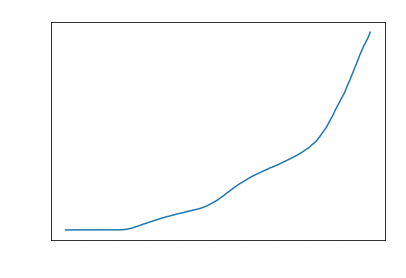

# COVID-19, 1 year later (from a political POV)

## Introduction

This is a statistical analysis and the impact that COVID-19 has had on different industries and services.

I will be analyzing the infection rates, infection trends, and the deaths of COVID-19 patients based on location. This will account for ALL infections and deaths around the world.

## The Problems:

- How has the political ideologies of a specific country impact the infection rate of COVID-19?
- Is there any correlation between political standings and COVID-19 infections? (USA)
- What was the impact of BLM on COVID-19 and is there correlations between them? (USA)

## The Data:

My sources will include:

- https://covidtracking.com/data/api
  - Where I am pulling COVID-19 infection rates

## 2020 infections:

